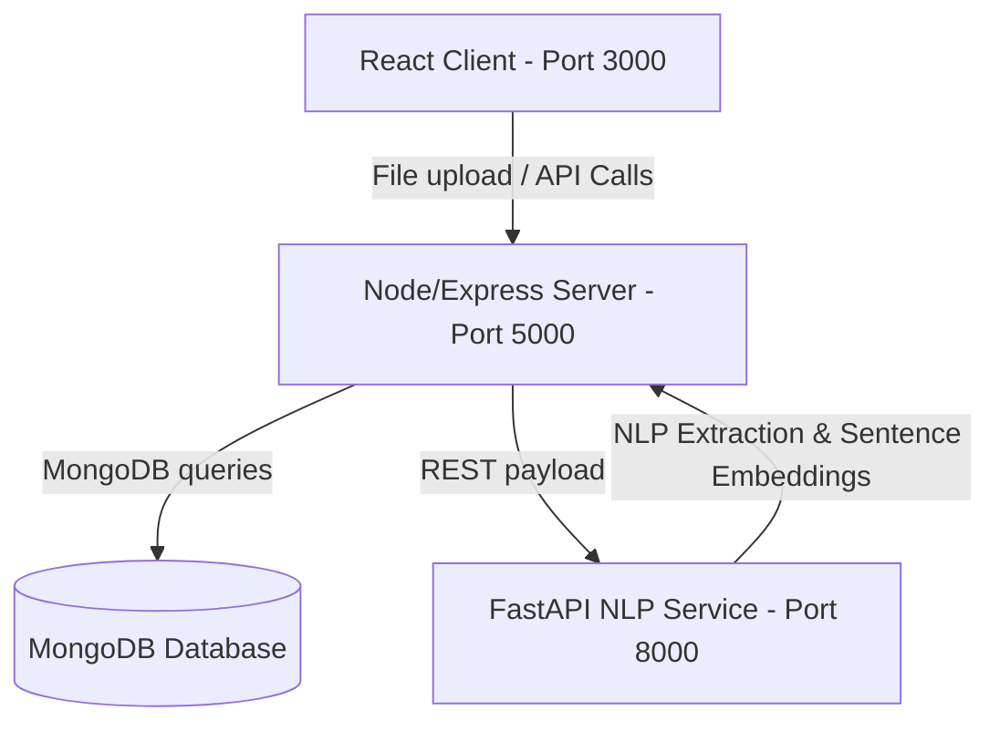

# ATSify 🎯 - AI-Powered Resume Analyzer & ATS Optimization Platform

ATSify is a modern, production-grade AI-powered Resume Analyzer & Applicant Tracking System (ATS) matching platform. It enables students to analyze their resumes, recruiters to post jobs and screen applicants sorted by semantic matching compatibility, and administrators to review system metrics.

The platform is designed to run **100% locally and privately**, requiring no external third-party cloud API costs.

---

## 1. 📝 Project Description

ATSify addresses the common gap between job seekers and recruiters by using natural language processing (NLP) to parse, score, and rank resumes against specific job descriptions. 

Key features include:
- **For Students**: Upload resumes (PDF/DOCX), get an instant ATS scoring breakdown, receive actionable AI-suggested bullet point rewrites, missing keyword alerts, suggested projects, and certifications.
- **For Recruiters**: Create job postings, list applicants, and view them automatically ranked using machine-learning semantic matching scores.
- **For Admins**: View aggregate platform usage metrics, user directories, and manage accounts.

---

## 2. 🏗️ Architecture & Directory Structure



### Repository Directory Structure
```text
ai-resume-analyser/
├── ai_service/               # Python FastAPI Microservice (NLP Engine)
│   ├── app/
│   │   ├── main.py           # API endpoints & routing
│   │   ├── nlp.py            # spaCy keywords & sentence transformers calculations
│   │   └── schemas.py        # Pydantic schemas
│   └── requirements.txt      # Python dependencies
├── backend/                  # Node.js + Express REST API Backend
│   ├── src/
│   │   ├── config/           # Database connections & seeding scripts
│   │   ├── controllers/      # Route logic handlers
│   │   ├── middleware/       # Custom mock authorization checks
│   │   ├── models/           # MongoDB schemas (Mongoose)
│   │   ├── routes/           # REST endpoints
│   │   ├── services/         # File parsers & FastAPI client handlers
│   │   └── app.js            # Express server entry
│   ├── uploads/              # Local disk storage for uploaded resumes
│   ├── package.json
│   └── .env.example
├── frontend/                 # React Single Page Application (Vite)
│   ├── src/
│   │   ├── components/       # Custom Layout UI elements
│   │   ├── context/          # React Context (theme, profiles, headers)
│   │   ├── pages/            # View managers (Landing, Student, Recruiter, Admin)
│   │   ├── index.css         # Global Styles & Tailwind imports
│   │   └── App.jsx           # Router & layout entry
│   ├── package.json
│   ├── tailwind.config.js    # Tailwind v3 config
│   └── vite.config.js        # Vite config with backend proxy
└── README.md
```

---

## 🛠️ 3. Tech Stack Used

- **Frontend**: React (Vite), TailwindCSS v3, HTML5, Vanilla CSS for glassmorphism animations.
- **Backend REST API**: Node.js, Express, Mongoose / MongoDB (Community Server or Atlas).
- **AI & NLP Engine**: Python 3.9+, FastAPI, Uvicorn, spaCy (for lightweight keyword matches), Sentence Transformers (for semantic cosine similarity matching).
- **File Parsing**: Multer (disk upload handling), pdf-parse, and mammoth (DOCX parser).
- **Containerization**: Docker & Docker Compose.

---

## 💡 4. Role-Based Mechanics & Access Control

Because this setup operates without a mandatory signup/login authentication screen, testing the entire platform is extremely simple:
- In the top-right header, you will see a **dropdown role switcher** (e.g., "Student Mode").
- Toggle the dropdown to select between **Student**, **Recruiter**, or **Admin**.
- The frontend will dynamically reload the dashboard, updating the active profile avatar and sending custom simulated headers to the Express API. The database links resumes, jobs, and applications to the correct profile automatically.

### Header-Based Security Context
All protected backend API endpoints expect the following headers:
- `x-user-role`: The active role/persona (`student`, `recruiter`, `admin`).
- `x-user-id`: The corresponding MongoDB `User` object `_id`.

### Workspace Personas & Access Control Matrix:
1. **Alex Student** (`student`):
   - **Upload Resumes**: `POST /api/resumes/upload`
   - **Check Scans History**: `GET /api/resumes/history`
   - **Clear Scans History**: `DELETE /api/resumes/history`
   - **Match & Analyze against Jobs**: `POST /api/resumes/analyze`
   - **Apply to Jobs**: `POST /api/applications/apply`
   - **List Submissions**: `GET /api/applications/student`
2. **Sarah Recruiter** (`recruiter`):
   - **Post Requisitions**: `POST /api/jobs`
   - **View Managed Jobs**: `GET /api/jobs?myJobs=true`
   - **Retrieve Candidates**: `GET /api/jobs/:id/applicants` (Sorted dynamically by AI compatibility ranking)
   - **Update Candidacy Status**: `POST /api/applications/:id/status` (Update status and add feedback)
3. **Devon Admin** (`admin`):
   - **User Management**: `GET /POST /PUT /DELETE` under `/api/admin/users`
   - **System Analytics Dashboard**: `GET /api/admin/analytics`

---

## 🔌 5. API Documentation & Integration

For a complete breakdown of request/response payloads, endpoints, Pydantic schemas for the FastAPI service, and status codes, refer to the detailed API guide:
👉 **[API Documentation](file:///C:/Users/govar/.gemini/antigravity/brain/c677182a-43c8-40f1-a85e-d15ee8970e71/api_documentation.md)**

---

## 🚀 6. Setup & Working Procedure

Ensure you have **Python 3.9+**, **Node.js 18+**, and **MongoDB (Community Server/Atlas)** installed.

### Step 1: Set Up & Run AI NLP Service

1. Navigate to the AI folder:
   ```bash
   cd ai_service
   ```
2. Create and activate a Python virtual environment:
   - **Windows:**
     ```bash
     python -m venv venv
     .\venv\Scripts\activate
     ```
   - **macOS/Linux:**
     ```bash
     python3 -m venv venv
     source venv/bin/activate
     ```
3. Install required libraries:
   ```bash
   pip install -r requirements.txt
   ```
4. Download the lightweight spaCy language model:
   ```bash
   python -m spacy download en_core_web_sm
   ```
5. Start the FastAPI server using Uvicorn:
   ```bash
   python -m uvicorn app.main:app --host 127.0.0.1 --port 8000 --reload
   ```

---

### Step 2: Set Up & Run Backend Server

1. Open a new terminal and navigate to the backend folder:
   ```bash
   cd backend
   ```
2. Install packages:
   ```bash
   npm install
   ```
3. Create your local environment file:
   ```bash
   copy .env.example .env
   ```
4. Seed the database (Creates default Student, Recruiter, and Admin accounts + 3 active job postings):
   ```bash
   npm run seed
   ```
5. Start the Express API server:
   ```bash
   npm run dev
   ```

---

### Step 3: Set Up & Run Frontend React App

1. Open a new terminal and navigate to the frontend folder:
   ```bash
   cd frontend
   ```
2. Install dependencies:
   ```bash
   npm install
   ```
3. Start the Vite development server:
   ```bash
   npm run dev
   ```
4. Open your browser and navigate to **[http://localhost:3000](http://localhost:3000)**.

---

### 🐳 Quick Start with Docker Compose (Alternative)

To run the entire system (Frontend, Backend, FastAPI NLP Service, and MongoDB) consistently in a single command, follow these steps:

1. Make sure Docker Desktop is installed and running.
2. Build and boot up the containers:
   ```bash
   docker-compose up --build
   ```
3. Run the database seed script inside the backend container to create mock accounts:
   ```bash
   docker exec -it atsify-backend npm run seed
   ```
4. Open your browser and navigate to:
   👉 **[http://localhost:3000](http://localhost:3000)**


